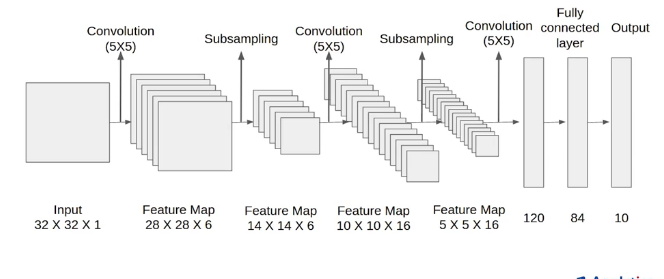

# LeNet-5 for MNIST Classification

This repository contains a PyTorch implementation of the LeNet-5 convolutional neural network for classifying the MNIST handwritten digit dataset.




## Introduction

The LeNet-5 model is a classic architecture designed by Yann LeCun and his collaborators for handwritten digit recognition. This implementation uses PyTorch to train and test the model on the MNIST dataset.

## Prerequisites

Make sure you have the following dependencies installed:

- Python 3
- PyTorch
- Matplotlib

Install the dependencies using the following command:

```bash
pip install torch matplotlib
```

## Usage

1. Clone the repository:

```bash
git clone https://github.com/yourusername/lenet5-mnist.git
cd lenet5-mnist
```

2. Run the script:

```bash
python lenet5_mnist.py
```

Feel free to adjust hyperparameters such as the number of epochs in the script.

## LeNet-5 Architecture

The LeNet-5 architecture consists of three convolutional layers followed by average pooling, and two fully connected layers. The activation function used is hyperbolic tangent (Tanh).

## Results

The script displays training and testing loss graphs, along with the test accuracy.

## Model Save and Load

The trained model can be saved and loaded using PyTorch's `torch.save` and `torch.load` functions. Example:

```python
# Save model
torch.save(Lenetmodel.state_dict(), 'lenet_model.pth')

# Load model
loaded_model = LeNetArchitecture()
loaded_model.load_state_dict(torch.load('lenet_model.pth'))
```

Feel free to experiment with hyperparameters to optimize the model's performance.

## Author

- Your Name
- Your Email Address
- Link to Your Portfolio or LinkedIn Profile

Please don't hesitate to reach out if you have any questions or feedback.


## REFERENCE : 

https://github.com/erykml/medium_articles/blob/master/Computer%20Vision/lenet5_pytorch.ipynb

